# Natural Language Processing project

### Topic Modeling
#### Crawiling
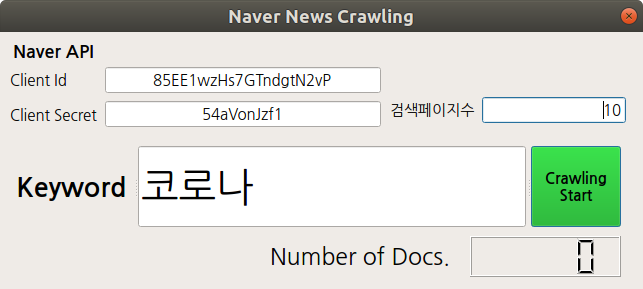

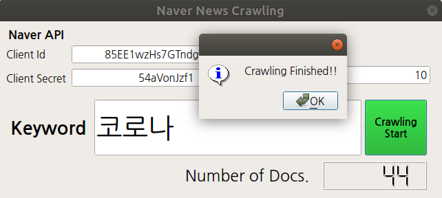

#### Tokenizing
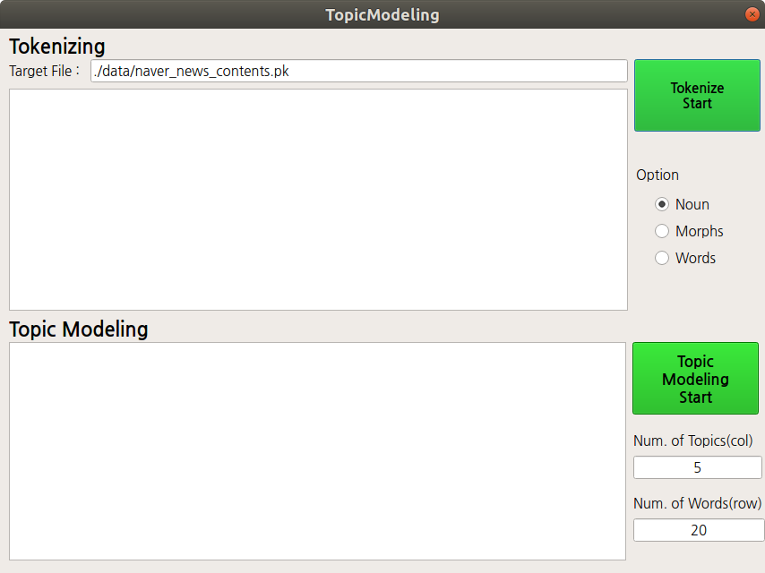

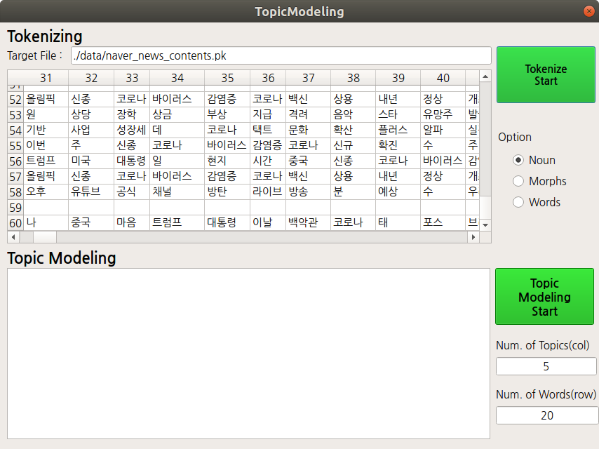

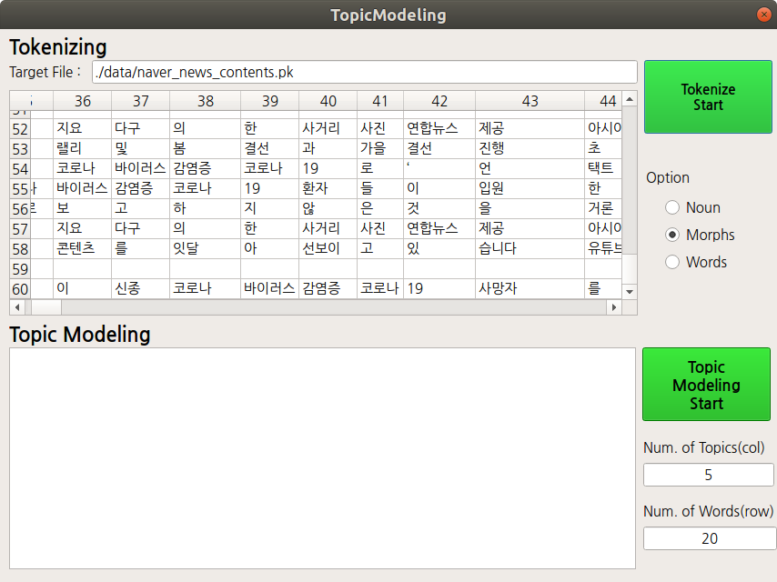

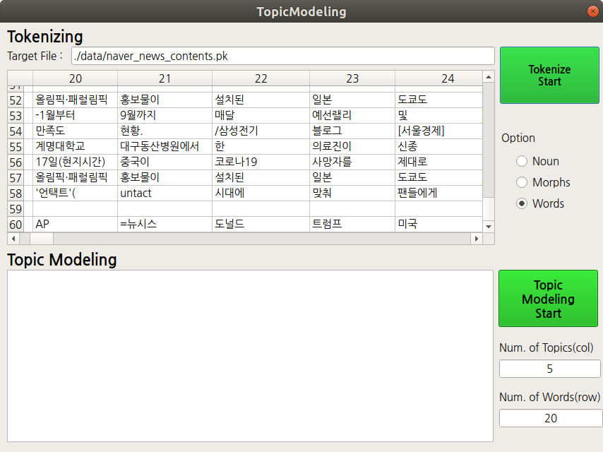

#### Topic Modeling
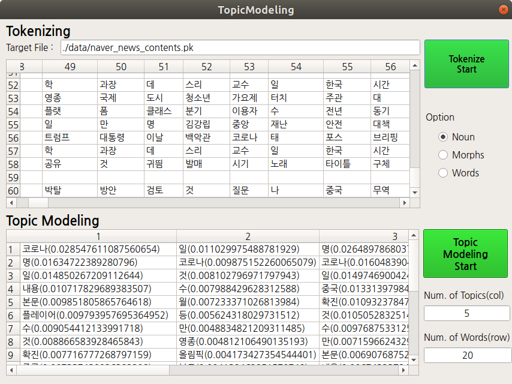

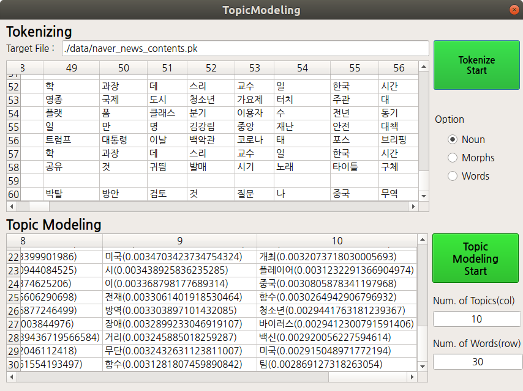

### Sentiment Analysis

#### Data Loading
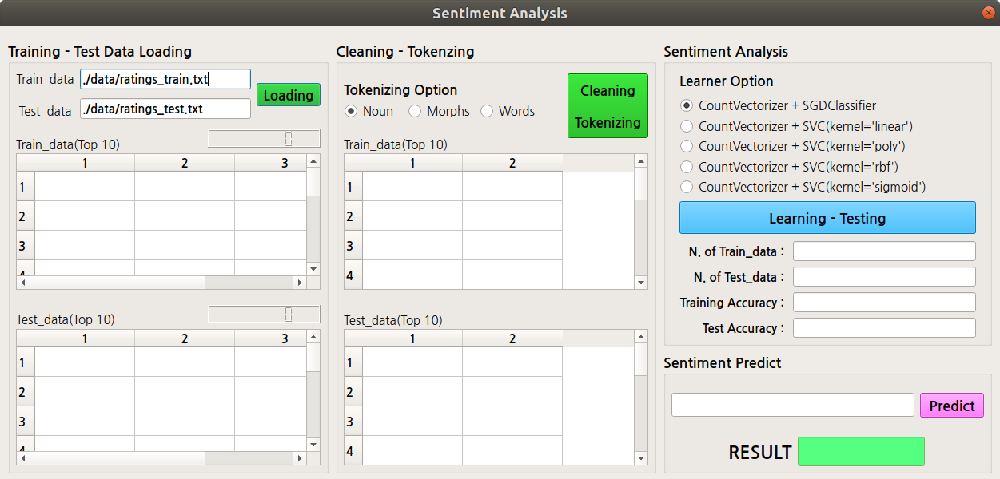

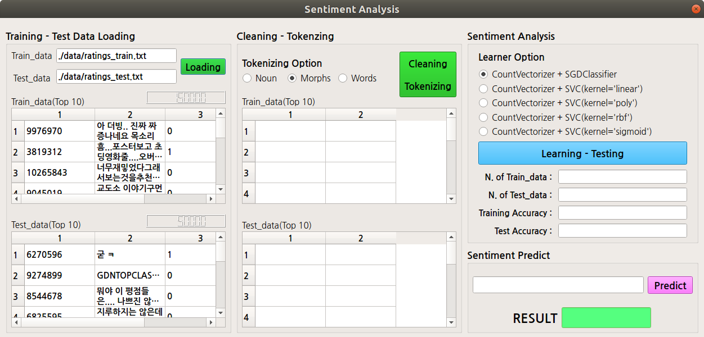

#### Cleaning & Tokenizing
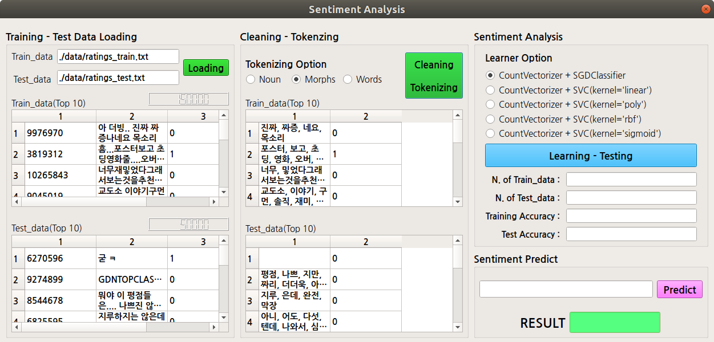

#### Learning & Testing
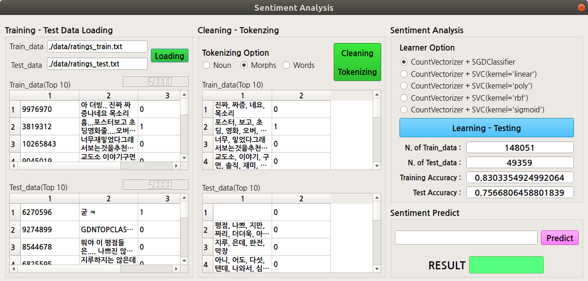

#### Predict

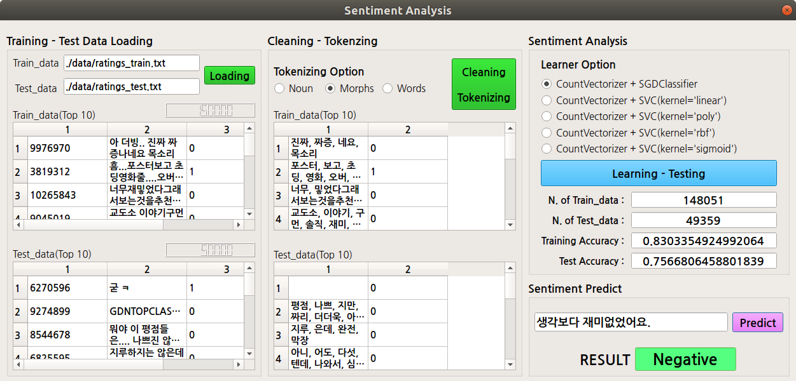